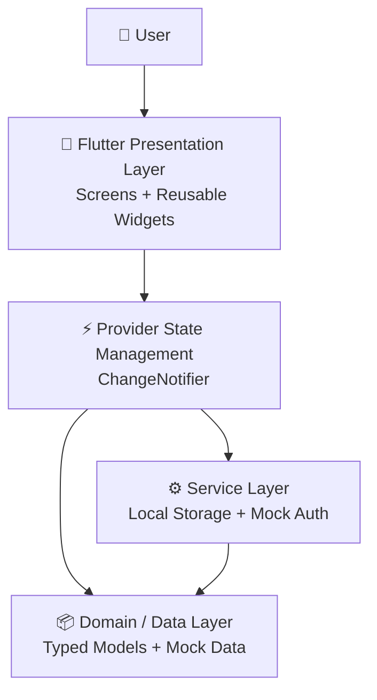
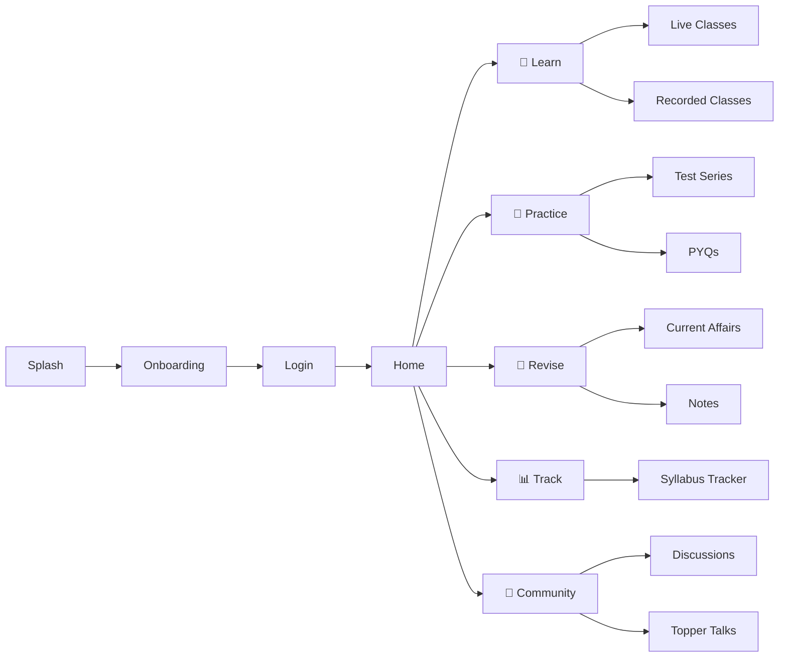
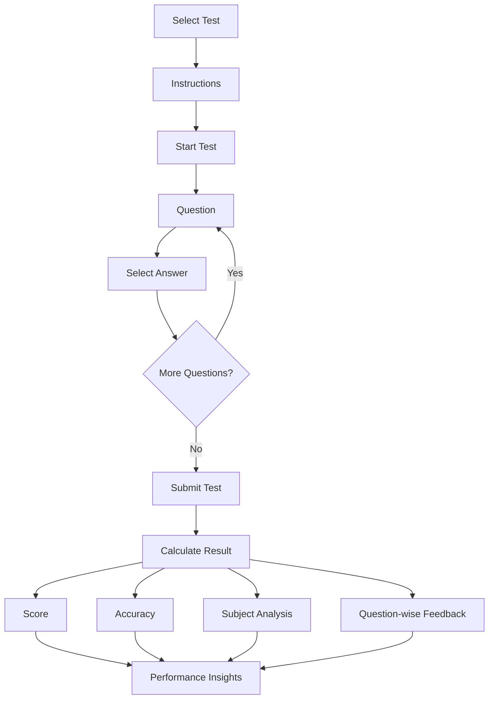
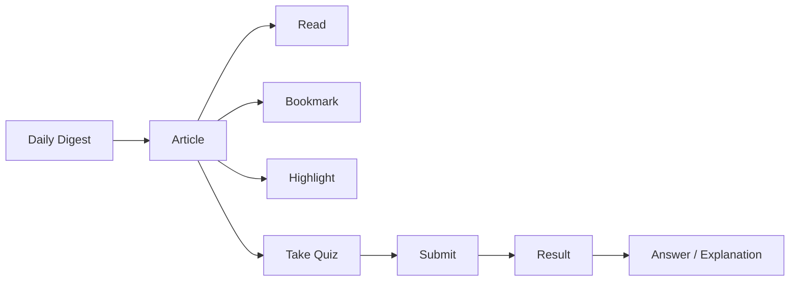
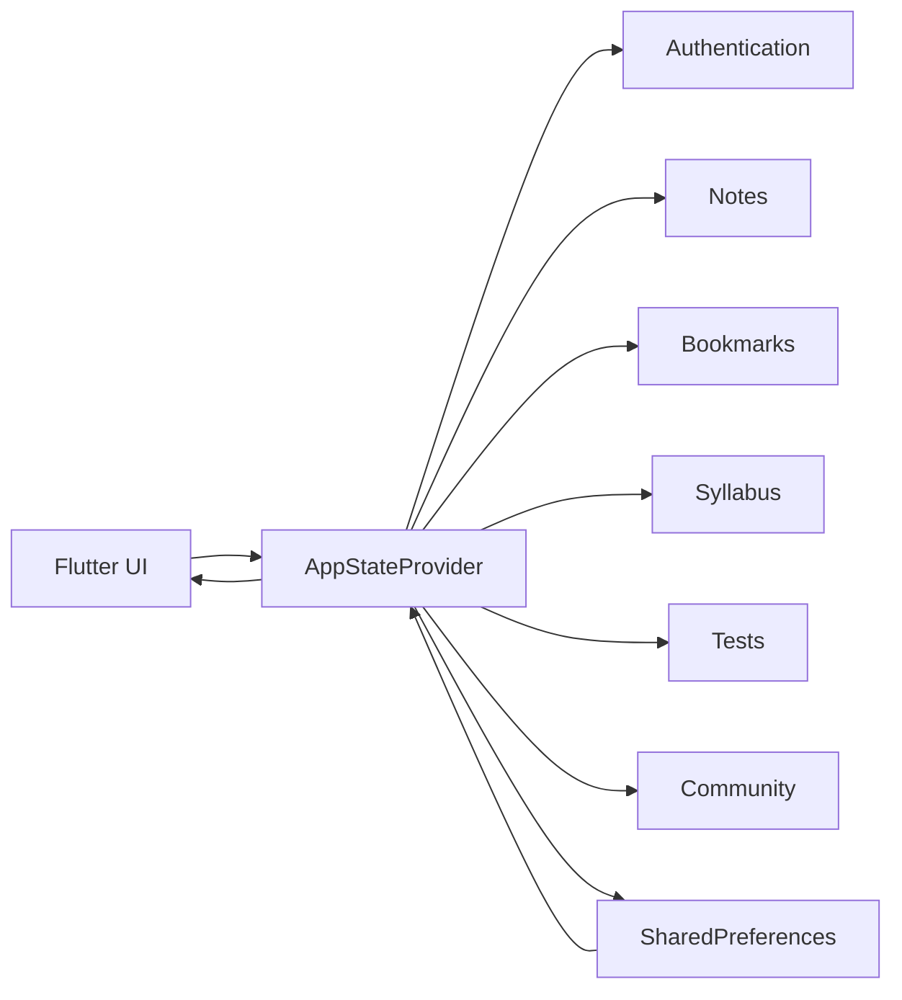

# 🇮🇳 SANKALP — UPSC CSE Preparation Platform

<div align="center">


<br>


<br><br>

**A specialized Flutter learning ecosystem built for UPSC Civil Services Examination aspirants.**

</div>

---

## 🧭 About Sankalp

**Sankalp** is a cross-platform Flutter application designed for UPSC aspirants, developed for:

> **Case Study 125 — Unacademy UPSC Preparation**

The application brings learning, practice, revision, progress tracking and community engagement together in a single platform.

Instead of switching between multiple tools for lectures, current affairs, tests, notes and discussions, Sankalp provides a unified preparation experience.

---

## ✨ Why Sankalp?

```text
        LEARN
          ↓
     LIVE CLASSES
          ↓
       PRACTICE
          ↓
    TESTS + PYQs
          ↓
       ANALYZE
          ↓
     IDENTIFY WEAKNESS
          ↓
       REVISE
          ↓
 NOTES + CURRENT AFFAIRS
          ↓
        TRACK
          ↓
   SYLLABUS PROGRESS
          ↓
      IMPROVE 🚀
```

---

# 🚀 Core Features

### 🎥 Live Classes

- Live class schedule
- Educator information
- Topic preview
- Interactive chat
- Polls
- Doubt submission

### 📚 Recorded Classes

Access previously recorded lectures and continue learning at your own pace.

### 📰 Current Affairs

- Daily current-affairs digest
- Article details
- GS/topic mapping
- Bookmarking
- Highlighting
- Current-affairs quiz
- Quiz results

### 📝 Test Series

- Multiple test categories
- OMR-style question interface
- Question navigation palette
- Answer selection
- Mark for review
- Test submission
- Detailed results
- Performance analysis

### 📊 Test Analysis

Understand performance through:

- Score
- Accuracy
- Correct / incorrect answers
- Subject performance
- Question-level feedback
- Performance indicators

### 🔖 Smart Notes

Create your own digital revision library.

- Create notes
- Edit notes
- Delete notes
- Bookmark notes
- Highlight important information

### 👥 Community

A discussion ecosystem for UPSC aspirants.

- Discussion feed
- Discussion details
- Replies
- Likes
- Create discussions
- Educator-focused discussions

### 👨‍🏫 Educator Profiles

View educator information including:

- Experience
- Expertise
- Student count
- Courses
- Teaching information

### 📚 Syllabus Tracker

Track preparation subject by subject.

```text
Polity       ███████████████░░  85%
History      ████████████░░░░░  70%
Geography    ██████████████░░░  78%
Economy      ██████████░░░░░░░  62%
Environment  █████████████░░░░  74%
```

### 📖 Previous Year Questions

- UPSC PYQ archive
- Year-wise questions
- Subject filtering
- Difficulty indicators
- Question analysis

### 🏆 Topper Talks

Free selected sessions featuring topper-oriented strategy and preparation guidance.

### 💳 Plus Subscription

The case-study pricing model is represented inside the application.

| Plan | Price |
|---|---:|
| ⭐ Plus | ₹24,999/year |
| 📚 Individual Course | From ₹2,499/subject |
| 📝 Test Series | ₹4,999 / 50 tests |
| 🏆 Topper Talks | Free selected sessions |

> Checkout is a demonstration flow for academic evaluation and is not presented as a live payment gateway.

---

# 🏗️ Application Architecture



---

# 🔄 User Flow



---

# 🔁 Test & Analysis Flow



---

# 🧠 Current Affairs Flow



---

# 📊 Feature-to-Problem Mapping

| Problem Statement | Sankalp |
|---|---|
| Live classes | ✅ |
| Chat | ✅ |
| Polls | ✅ |
| Doubt clearing | ✅ |
| Recorded sessions | ✅ |
| Current affairs | ✅ |
| Current affairs quiz | ✅ |
| Test series | ✅ |
| OMR-like evaluation | ✅ |
| Detailed analysis | ✅ |
| Notes | ✅ |
| Highlight | ✅ |
| Bookmark | ✅ |
| Community forum | ✅ |
| Educator profiles | ✅ |
| Syllabus tracker | ✅ |
| PYQ analysis | ✅ |
| Difficulty indicators | ✅ |
| Plus subscription | ✅ |
| Topper Talks | ✅ |

---

# 🛠️ Tech Stack

<div align="center">

| Technology | Purpose |
|---|---|
| **Flutter** | Cross-platform UI |
| **Dart** | Programming language |
| **Provider** | State management |
| **ChangeNotifier** | Reactive state updates |
| **SharedPreferences** | Local persistence |
| **Material 3** | UI framework |
| **Google Fonts** | Typography |
| **fl_chart** | Charts & analytics |

</div>

---

# 📂 Project Structure

```text
lib/
│
├── app/
│   ├── app.dart
│   ├── routes.dart
│   └── theme.dart
│
├── data/
│   └── mock_data.dart
│
├── models/
│   ├── user_model.dart
│   ├── educator_model.dart
│   ├── course_model.dart
│   ├── class_model.dart
│   ├── test_model.dart
│   ├── question_model.dart
│   ├── quiz_model.dart
│   ├── note_model.dart
│   ├── discussion_model.dart
│   ├── topic_model.dart
│   ├── pyq_model.dart
│   ├── subscription_model.dart
│   └── topper_talk_model.dart
│
├── services/
│   ├── app_state_provider.dart
│   ├── local_storage_service.dart
│   └── mock_auth_service.dart
│
├── utils/
│
├── widgets/
│
└── screens/
    ├── auth/
    ├── community/
    ├── courses/
    ├── current_affairs/
    ├── educators/
    ├── home/
    ├── live_classes/
    ├── notes/
    ├── onboarding/
    ├── profile/
    ├── pyq/
    ├── recorded/
    ├── subscription/
    ├── syllabus/
    ├── tests/
    └── topper_talks/
```

---

# ⚡ State Management

Sankalp uses **Provider + ChangeNotifier** to maintain centralized application state.



This provides:

- Centralized state
- Reactive UI updates
- Separation of UI and business logic
- Easier feature expansion
- Local persistence

---

# 💾 Local Persistence

The academic version uses local persistence for demo functionality.

Stored application information can include:

```text
Onboarding State
       ↓
Login State
       ↓
Theme Preference
       ↓
Bookmarks
       ↓
Notes
       ↓
User Preferences
```

---

# 🧪 Testing & Validation

The application includes a Flutter test structure and can be evaluated using the following flows:

| Test | Expected Result |
|---|---|
| Launch App | Splash appears |
| Onboarding | User reaches authentication |
| Login | Dashboard opens |
| Live Class | Class details displayed |
| Poll | User can interact |
| Doubt | Doubt submission works |
| Current Affairs | Article opens |
| Quiz | Result generated |
| Test | Questions load |
| OMR Navigation | Question state changes |
| Submit Test | Result generated |
| Analysis | Performance displayed |
| Notes | CRUD operations work |
| Bookmark | State persists |
| Syllabus | Progress changes |
| PYQ | Questions and difficulty appear |
| Community | Discussion interaction works |
| Subscription | Pricing displayed |
| Theme | Light/dark mode changes |

---

# 📈 Product Vision

Sankalp is designed around five pillars:

```text
        ┌─────────────────┐
        │     LEARN       │
        │ Classes + Videos│
        └────────┬────────┘
                 │
    ┌────────────▼────────────┐
    │       PRACTICE          │
    │ Tests + PYQs + Quizzes  │
    └────────────┬────────────┘
                 │
    ┌────────────▼────────────┐
    │        REVISE           │
    │ Notes + Current Affairs │
    └────────────┬────────────┘
                 │
    ┌────────────▼────────────┐
    │         TRACK           │
    │ Syllabus + Performance  │
    └────────────┬────────────┘
                 │
    ┌────────────▼────────────┐
    │        ENGAGE           │
    │ Community + Topper Talks│
    └─────────────────────────┘
```

---

# 🔮 Future Scope

### ☁️ Cloud Backend

Replace mock data with a production backend and database.

### 🔐 Real Authentication

Implement secure authentication and role-based access.

### 🎥 Live Streaming

Integrate WebRTC/live streaming infrastructure.

### 💬 Real-Time Communication

Use WebSockets for live chat, polls and doubt resolution.

### 🤖 AI Study Assistant

Provide:

- Personalized study plans
- Weak-topic detection
- AI explanations
- Smart revision
- Adaptive questions

### 🔔 Push Notifications

Notifications for:

- Upcoming classes
- Test reminders
- Current affairs
- New courses
- Important UPSC updates

### 💳 Payment Integration

Integrate a secure payment gateway for real subscriptions.

---

# 🎓 Academic Information

**Project:** Sankalp – UPSC CSE Preparation Platform  
**Case Study:** 125 – Unacademy UPSC Preparation

**Student:** Atharva Pravin Gahine  
**Roll No.:** 150096724079  
**Program:** B.Tech Computer Science Engineering & AI  
**Semester:** V  
**Institute:** ITM Skills University

---

# 🏆 Project Highlights

<div align="center">

### 🎥 Learn

Live + Recorded Classes

### 📝 Practice

Tests + PYQs + Quizzes

### 🔖 Revise

Notes + Current Affairs

### 📊 Track

Syllabus + Performance

### 👥 Engage

Community + Topper Talks

</div>

---

# 🚀 Getting Started

### Prerequisites

```bash
Flutter SDK
Dart SDK
Android Studio / VS Code
Android Emulator / Physical Device
```

### Clone Repository

```bash
git clone YOUR_GITHUB_REPOSITORY_URL
cd Sankalp
```

### Install Dependencies

```bash
flutter pub get
```

### Run Application

```bash
flutter run
```

### Run Tests

```bash
flutter test
```

### Static Analysis

```bash
flutter analyze
```

---

# 📌 Academic Note

This project is developed as an **academic Flutter application** based on the provided Unacademy UPSC case study.

The current implementation uses demo/mock data and local persistence where applicable. Production integrations such as real payment processing, cloud authentication, live video infrastructure and backend APIs can be added as future enhancements.

---

<div align="center">

## 🇮🇳 SANKALP

### **Prepare Smarter. Serve Better.**

**Built with Flutter & Dart ❤️**

---

**Atharva Pravin Gahine**  
**150096724079**

⭐ If you like this project, give it a star!

</div>
